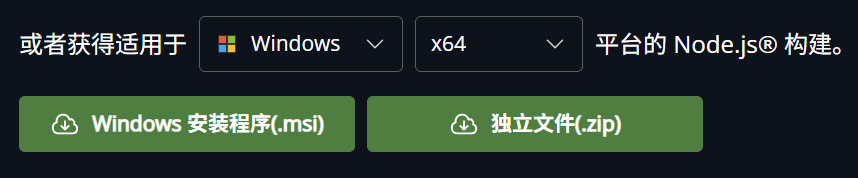
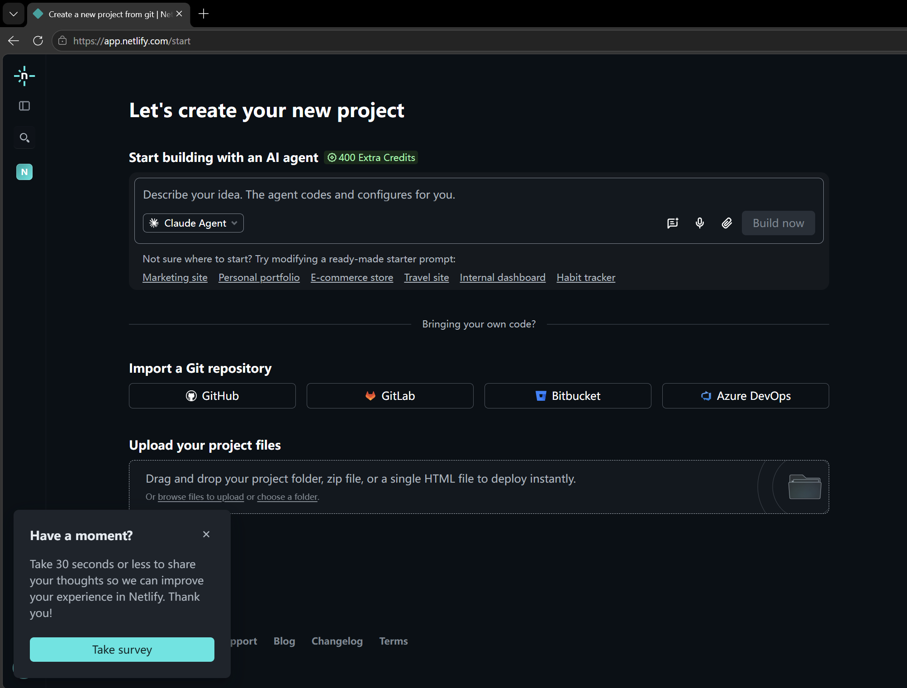

## 欢迎来到 **Novic.cc**

我在 23 年就购入了这个域名，并尝试建立一个个人网站。

那时，我还完全没有相关经验， AI 也远没到今天这种水平，所以我边学前端三件套，边慢慢折腾。我先是使用 Gatsby.js ，套用它的博客模板尝试自己改。后来又换 Astro 重写了一次（依然是套用模板），花了挺长时间在修改主题色和背景上。现在这个网站的背景便是沿用了那一版的设计。

但我当时折腾这些并不是真的想写博客，而主要是想试着自己建一个网站。因此在把背景主题调得让自己满意之后就没有继续了（甚至示例文章和模板里的 github 链接之类的都没换）。之后我在折腾虚拟组网时，把一些局域网内链接添加到了网站上方便我自己访问。之后就很久没有更新这个网站了。那是 24 年。

## 再次建站

### 心血来潮

最近，突然又重拾了建站的想法。买了个域名摆在这里，总得利用起来，是吧？  
并且现在的 AI 前端也相当强了。遂决定整个厉害点的模型，依旧使用 Astro ，从 0 开始写个博客网站。

御三家的模型大抵是不好整的。思索之后，决定开个 OpenCode GO 尝试一下 GLM5.2 ，顺便试试 OpenCode 。

### 开发环境搭建

（_详细步骤详见 [后文](#完整的环境配置和开发部署流程)_ ）

目前我日用的环境是 VSCode + ClaudeCode Extension + DeepSeek V4 Pro

这次要用 OpenCode ，一开始的想法自然也是整个 VSCode 扩展

扩展要求先装 cli （我的评价是不如 ClaudeCode 扩展那样内嵌一个）

于是打开官网文档看看如何安装

众所周知目前的 AI 模型对 Bash 命令表现最好，而 OpenCode 在 Windows 上并不像 ClaudeCode 那样使用 Git Bash ，因此比较好的方式是使用 WSL （这也是官方推荐的方式）。

在我的 Debian WSL 里安装好 OpenCode 后下载了 VSCode 扩展，然后发现这个扩展...实在有些难说，其实就是分出一个窗口打开终端的 TUI ...与 ClaudeCode 和 Codex 的 GUI 相比差远了。我直接就是一个绷不住了，然后卸载了扩展。

在 [官方 WSL 文档](https://opencode.ai/docs/windows-wsl) 中看到，GUI 有 **Win 桌面应用 + WSL 服务器** 和 **Win 浏览器 + WSL 服务器** 两种方式

两种都试了一下，然后发现 OpenCode 桌面应用纯纯 Web 套壳（最近好像还看到说从 Tauri 换 Electron 了）。那么对于我来说完全没必要安装桌面应用， WSL Web 服务器 + Win 浏览器 的方式是更方便舒服的。

至此，开发环境搭建完成。

<div class="text-sm text-white/50">

后话：

我一直以来都是使用 VSCode + Agent 侧边栏的形式进行开发，这次使用 OpenCode 是我第一次在这种 _以 Agent 为核心构建的交互界面_ 下开发。

就我本人来说，我还是经常需要看看文件树和代码（更别说我还要写 mdx ），而 OpenCode 的文件操作界面还是比不上 IDE ，（也不能手动编辑？）而是更贴近于 Github Review 的那种体验。

所以我依旧在我的后台开着 VSCode，两个窗口来回切换。  
（所以 OpenCode 你的 VSCode 扩展能不能做个 GUI 的 QAQ）

</div>

### 选择技术栈

我只敲定了 Astro 7 和 pnpm ，以及提醒要加上格式化工具，其它都是由 AI 建议和设置的。

当前架构如下：

| 类别     | 选型                                                     |
| -------- | -------------------------------------------------------- |
| 框架     | Astro v7（静态）                                         |
| 内容格式 | Markdown / MDX                                           |
| 样式     | Tailwind CSS v4（`@tailwindcss/vite` + Typography 插件） |
| 代码高亮 | Expressive Code（行号、行高亮、复制、diff）              |
| 锚点     | rehype-slug + rehype-autolink-headings                   |
| 搜索     | Pagefind（构建期生成索引）                               |
| SEO      | @astrojs/sitemap + canonical + OG/Twitter                |
| RSS      | @astrojs/rss                                             |
| 构建工具 | Vite v8 (rolldown 内核)                                  |
| 包管理   | pnpm v11                                                 |
| 类型检查 | Astro check + TypeScript v6                              |
| 格式化   | Prettier + prettier-plugin-astro                         |

确定技术栈后便让 GLM 5.2 写出了一个初始框架。接下来的开发便是不断向 AI 提出需求，然后验收。  
OpenCode GO 用 GLM 5.2 体感上额度消耗得挺快的，因此我还接入了 DeepSeek 的 API ，小任务使用 DeepSeek V4 Pro 。

就我的体感而言，并没有体会到 GLM 5.2 的前端美术强到什么特别的程度。当然也有可能是因为我的大部分设计细节都自己描述得相当清楚，没有留给它很大的发挥空间。  
（如果我不描述具体一点，它做出来的效果似乎也达不到我的预期）

## 开发过程中的小问题

### 代码能否完全交给 AI

对于这种复杂度较低的小型博客网站，只要手动测试下来没有问题，那其实大抵就是 OK 的。毕竟前端嘛，主要就是视觉效果。

但就我而言，还是会大概扫一遍代码。其实很多相关语法我也不是那么了解，但是大概的结构还是要清楚。

明白项目结构，才能更好地给 AI 提出修改建议，并且在出一些奇奇怪怪的问题时可以更快~~也更省钱~~地排查出来。

一些代码风格上细节也需要主动告诉 AI 怎么写更优雅  
（当然你要是完全不看代码，也不会注意到这些细节。~~就让 AI 写屎山也没事，反正代码量不大，不太容易出事~~）

所以，**总的来说**：

AI 的确让开发网站的门槛和难度降低了非常多。即使你完全没有相关经验，也可以**相当轻松**地做出一个网站（对于你来说最难的一步或许将是搭建开发环境）。  
只要你有设计的想法， AI 就能帮你实现。  
不过，如果完全不看代码，你会需要在 AI 上花费更多的 time 和 money 来达到你要的效果。

因此，我的建议是：**可以不懂语法，但最好不要不懂代码**。在搭建的过程中有意识地去了解熟悉相关逻辑（如果不懂让 AI 解释就好了），去注意一些技术细节，然后才能引导 AI 写出质量更好的代码。

_我目前对前端并不是非常熟悉，这些话不一定正确，仅作为当前的感想，提供一些参考。_

### Debian 安装 Node.js

Debian 13 (Trixie) 默认仓库自带的是 Node.js 20 ，已经终止支持。当前最新 LTS 版本为 24 。

我选择使用 NodeSource + extrepo 安装 Nodejs ，好处是依旧由 apt 托管更新

```bash
# 安装 extrepo
sudo apt update
sudo apt install -y extrepo

# 启用 NodeSource 的 Node.js 24.x 源
sudo extrepo enable node_24.x

# 更新并安装
sudo apt update
sudo apt install -y nodejs

# 验证
node -v   # 应输出 v24.x.x
npm -v    # 应输出 11.x.x
```

卸载：

```bash
sudo extrepo disable node_24.x
sudo rm -f /etc/apt/sources.list.d/extrepo_node_24.x.sources
sudo rm -f /var/lib/extrepo/keys/node_24.x.asc
sudo apt remove --purge nodejs
sudo apt update
```

### 字体子集化

如果要在网站中使用自定义字体，将中文字体文件直接整体导入是不现实也不优雅的。  
中文字符多，文件非常大，加载缓慢，影响体验也浪费流量。

因此网络使用中文字体一般都会进行子集化，删除用不到的字符数据，精简文件体积。

接下来具体列出两种方案

#### 切片

将字体文件分割成许多小切片（目前主流是按照 Unicode 范围切割），文章中出现哪些字符，浏览器就请求下载对应的切片。

这种方案能够简便而有效地提升加载速度，并且不需要考虑实际需要哪些文字，只需提前对字体文件进行一次切片预处理，便不需要再操心。

我最初便决定使用这个方法，使用 [cn-font-split](https://github.com/KonghaYao/cn-font-split) 项目的 `vite-plugin-font` 插件实现。  
~~具体怎么实现的去问 AI 吧~~

#### 只保留实际使用的字符

极限压缩字体文件，只保留网站中使用到的字符数据。

这种方案优化更加彻底，保证没有一点多余的数据被传输。

而缺点则是每次更新网页内容，都需要重新进行子集化。  
并且当网站页面比较多，总字符量比较大时，得到的子集文件可能也不小（相较于切片）。

这时候，聪明的你要说了：欸，那我再切片一下不就好了？对每个页面分别进行子集化，这样就结合了两种方法的优点！

没错，我最开始也是这么想的。但 GLM5.2 提醒了我：每个页面分别子集化会导致在不同页面重复使用的文字被重复打包，这样随着浏览页面数的增多，下载的字体量线性增长。这不是很优雅。  
所以我当时的想法是：直接切片算了，按实际子集化不好搞。

**但是啊，但是啊**，聪明的你又说了：欸？那我先扫描出实际使用的字符，再按 Unicode 范围切片。这样不就解决了？  
天才！简直是天才！后来我发现 [cn-font-split 有一个“极小量级优化”功能](https://github.com/KonghaYao/cn-font-split/blob/release/packages/vite/README_zh.md#极小量级优化) 便是这个逻辑。这也是这个网站最终采取的方案。

<div class="text-sm text-white/50">
折腾字体真的花了我好多 token 啊。sad

以及有一点要注意：  
`Expressive Code` 的代码块字体设置 `--ec-codeFontFml` 是硬编码的，需要额外覆盖一下
</div>

## 完整的环境配置和开发部署流程

下面的流程基于最新版本的 Windows 11

### VSCode 和 WSL （可选）

#### Visual Studio Code

VSCode 是一个轻量 ~~(?)~~ 而功能强大的编辑器，支持几乎所有语言。  
如果你决定完全不操作代码，可以跳过这一步。

打开 [VSCode 官方网站](https://code.visualstudio.com/) 下载安装包并安装。

首次打开 VSCode ，在左边侧栏找到 Extension 扩展选项（也可以使用 <kbd>Ctrl</kbd>+<kbd>Shift</kbd>+<kbd>X</kbd> 快捷键打开），搜索 Chinese ，安装简体中文语言包。  
安装完成后右下角会有提示 是否要切换语言并重启 VSCode 。重启完 UI 界面就会变成中文。  
如果错过了那个提示弹窗，可以使用快捷键 <kbd>Ctrl</kbd>+<kbd>Shift</kbd>+<kbd>P</kbd> 打开命令面板，输入 lang ，选择 `Configure Display Language` ，即可更改显示语言。

#### Windows Subsystem for Linux

WSL 可以让我们在 Windows 中高效地运行一个 Linux 发行版，并丝滑地集成到日常的开发工作中。

推荐使用 WSL 的原因主要有二：

1. AI 相较于 Windows 更熟悉 Linux 的命令行（训练数据更多），并且 Linux 命令行标准更统一。
2. 把 Agent 放在 WSL 中运行相当于进行了一层隔离，更加安全（但其实通过 `mnt/` 也能访问到 Win 上的文件）

但如果不熟悉命令行，增加一层 WSL 可能会增加上手和理解的难度。因此请自行选择是否安装 WSL 。后文的教程将会同时对 WSL 和 Win 介绍。

根据 [WSL 官方文档](https://learn.microsoft.com/zh-cn/windows/wsl/install) ，打开 终端 （ CMD / Powershell 皆可）运行 `wsl --install` 即可安装

**但是**默认将会安装 Ubuntu 发行版，而我推荐使用 Debian （关于发行版的选择可自行搜索，后文以 Debian 13 为例）。  
因此，安装使用：

```powershell
wsl.exe --install -d Debian
```

安装完后需要初始化系统（设置用户名和密码）。具体过程和其它可选配置此处省略。

之后在开始菜单的应用列表里可以找到 Debian 。也可以在 终端 的选项卡中打开 Debian 的命令行。  
后文中 Debian 版块的命令都需要在 Debian 的命令行中运行。

还有一个**重要的推荐设置**：在开始菜单中找到并打开 WSL Settings ，找到 网络 选项卡，将网络模式更改为 `Mirrored` 。  
（进行了这个设置后，就可以通过 `127.0.0.1` 本地回环地址访问 WSL 中开放的服务。）

_如果完成了相关安装和设置却疑似没有生效，可尝试重启相关软件或者直接重启电脑_

### Node.js

Node.js 是一个 JavaScript 运行时环境，如今大部分网站技术栈都依托它来运行

建议使用最新的 LTS （长期支持）版本

#### Windows

直接在 [官方网站](https://nodejs.org/zh-cn/download) 下载最新的 Windows 安装程序(.msi) 并安装即可。



#### Debian

参考 [Debian 上安装 Nodejs 最新 LTS](#debian-安装-nodejs)

### Git

Git 是一个开源的分布式版本控制系统，对于项目开发和管理可以说是必需的。推荐安装。

但本文将不会介绍 Git 的使用方式。感兴趣可自行研究

_Git 的操作是纯命令行的，但如果安装了 VSCode，一部分操作可以在 VSCode 的 GUI 上完成。_

#### Windows

可从 [Git for Windows 官网](https://git-scm.com/install/windows) 下载安装包( Git for Windows/x64 Setup )

也可以通过 winget 安装——直接在终端中运行：

```powershell
winget install --id Git.Git -e --source winget
```

安装完成后运行 `git --version` 来验证是否安装成功（应输出版本号）。

#### Debian

```bash
sudo apt update && sudo apt install git
```

安装完后同样通过 `git --version` 来验证。

### OpenCode

#### Windows

Windows 上可以直接从 [官网](https://opencode.ai/zh/download) 下载桌面应用安装包并安装使用。

#### Debian

运行 `npm i -g opencode-ai` 即可安装

如果官方源下载慢，可以先配置阿里镜像源再安装：

```bash
npm config set registry https://registry.npmmirror.com
npm i -g opencode-ai
```

安装完成后运行

```bash
opencode web --hostname 127.0.0.1 --port 46229
```

然后在浏览器中打开命令行中显示的`Web interface`地址（不出意外应该是 http://127.0.0.1:46229/ ）即可看到 OpenCode 的面板。与桌面应用的界面一模一样。

<div class="text-sm text-white/50">
细心的你可能会发现，运行时还报了一个 Warning :
<p class="text-yellow-300"> !  OPENCODE_SERVER_PASSWORD is not set; server is unsecured. </p>
但是不用担心。我们只在 127.0.0.1 上开放了服务，仅本机可访问，因此不需要设置密码也是安全的。
</div>

### 选择技术栈并初始化项目

首先要定下的核心技术栈是：**包管理器**和**网站框架**

可自行了解选择，这里以我使用的 pnpm 和 Astro 为例介绍如何初始化项目

_后文若无特殊说明，则表示无论是 Windows 还是 Debian ，都是输入相同的命令_

#### 安装 pnpm

我们安装的 Node.js 默认的包管理器是 npm 而不是 pnpm ，因此我们首先要安装 pnpm。

使用：

```bash
npm install -g pnpm
```

即可安装（如果慢可[配置镜像源](#debian-2)）

安装完成后建议给 pnpm 也配置镜像源：

```bash
pnpm config set registry https://registry.npmmirror.com
```

#### 初始化 Astro 项目

首先在命令行里打开用于放置你的项目的文件夹（不是项目的文件夹，而是放置项目文件夹的文件夹，懂？）

如果是 Windows ，可以直接在 文件资源管理器 中打开文件夹，然后右键空白部分，选择 在终端中打开 。  
也可以先打开终端，然后使用 `cd <文件夹路径>`[^1] 来切换文件夹。如果是跨盘符（如从 C 盘切换到 D 盘）则需要使用 `cd /d <文件夹路径>`[^1] 。

对于 Debian ，可以通过 `ls` 查看当前目录文件，`mkdir` 创建新目录，`cd` 切换目录。  
对于不熟悉 Linux 的人，建议直接使用默认的用户`home`目录，无需切换。

进入到正确的目录后，运行：

```bash
pnpm create astro@latest
```

即可进入项目初始化流程。

根据提示完成后便会在当前目录下自动创建好你的项目的文件夹。（还会帮你初始化好 Git 仓库）  
对于 Windows ，可以在文件资源管理器中直接看到；对于 Debian ，使用 `ls` 查看是否创建成功。

在命令行中通过 `cd <文件夹名>`[^1] 进入你的项目文件夹，然后运行 `code .` （注意有个`.`）即可在 VSCode 中打开该文件夹

打开 OpenCode，在 GUI 中可以选择并打开该文件夹。接下来就可以让你的 AI 来写网站了。关于项目有任何疑问也可以问它。  
_对于 Debian ，如果你的项目文件夹在用户 home 目录下，那它的路径应该是 `~/<项目文件夹名>`_

#### 一些常用指令

```bash
pnpm astro dev              # 启动开发服务器（用于实时预览网站效果）关闭终端窗口后便会关闭
pnpm astro dev --background # 启动开发服务器（后台模式）关闭终端窗口后仍会保持运行
pnpm astro dev stop         # 停止开发服务器 （后台模式要通过这个指令关）

pnpm run build              # 以当前代码构建网站（不会随代码更新而实时更新，而是需要手动构建）
pnpm run preview            # 启动网页服务器预览构建产物
# 构建产物在 dist/ 目录

```

[^1]:
    `cd <路径>` 中的路径，既可以是绝对路径( `D:/Projects/My-site` )也可以是相对路径( `My-site` )。相对路径即叠加在当前所在的目录上。  
    在相对路径中， `./` 表示当前目录， `../`表示上一级目录。  
    所以，如果你当前正在 `D:/Projects` 目录，则 `cd D:/Projects/My-site` 、`cd ./My-site` 和 `cd My-site`是等效的。  
    切换目录时可根据情况来使用更方便的路径表示方法。

### 发布网站

#### 全自动发布流程

我们使用 Astro 构建静态网站，在 [Github Pages](https://docs.astro.build/zh-cn/guides/deploy/github/)、 [Vercel](https://docs.astro.build/zh-cn/guides/deploy/vercel/) 、 [Netlify](https://docs.astro.build/zh-cn/guides/deploy/netlify/) 等平台都可以部署。可自行查阅相关文档。

这种方式会需要使用 Git ，将代码托管到 Github 之类的平台。在这里就不详细介绍了

#### 手动发布

上面的方式对于不熟悉的人来说可能有些难以上手，因此在此介绍一种更为简单的手动发布方式

我们使用 Netlify 平台的免费套餐服务

首先 [注册一个账号](https://app.netlify.com/signup)  
如果没有 Github 账号，可以选择 `sign up with email`使用邮箱注册

然后在 `Projects` 页面选择 `Add new project` 来新建网站



可以看到，下面有一个 `Upload your project files` ，可以直接从本地上传

_（只有静态网站可以这样部署。幸运的是，我们开发的正是一个静态网站）_

前面提到了，`pnpm run build` 用于构建网站，构建产物在 `dist/` 下

因此，只需要在此处上传 `dist` 文件夹即可部署。

到此便**大功告成**

在项目管理面板中能上传新的 `dist` 手动更新网站  
还能更改网站域名之类的  
可以自行研究
